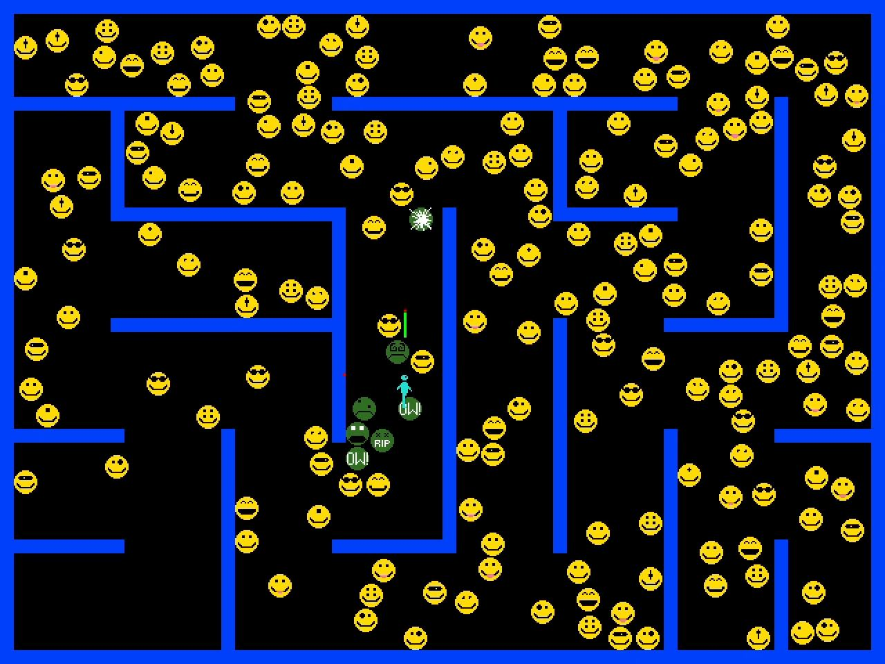

This is a simple example of how to use Pyglet to create a "twin-stick shooter" -style game.

You move the blue human with the arrow keys, and fire bullets with the `WASD` key cluster.

A simple space partitioning algorithm is used to detect collisions between all of the enemies and each other, as well as yourself. This way hundreds of enemies can be on screen at once with relatively little performance impact.

This example will continue to be updated over time, but you are free to use it as a basis for your own games.

## Setup

Create a virtual environment, and `pip install` the contents of the archive.

Use `blobs.exe` to launch a windowed version of the game, and `blobs_c.exe` to launch one with a console for debugging information.

## Creating a standalone executable (Win32 only)

I've designed this project to be redistributable as a Windows .exe with my `pydeploy` project. To that end, this project can be used as the basis for a redistributable game.

1. `pip install git+https://github.com/syegulalp/pydeploy` in the venv where you installed the game. (You will need `git` for this to work. You can also make a local copy of that repo and `pip install` from that.)
2. Run `pydeploy .` to create a `deploy_<python version>` subdirectory. The subdir will contain a `.zip` archive of the game, along with a `dist` subdirectory that contains the contents of the achive.

## License

MIT